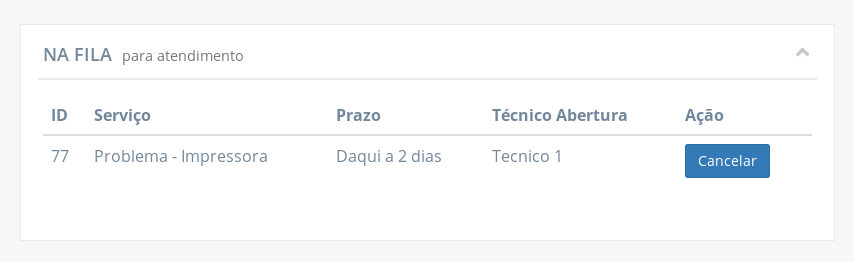

# Funcionalidades do cliente

As funcionalidades a seguir estão disponíveis para usuários que tem a função de cliente.

## Solicitar chamado

Na página "Solicitar atendimento" o cliente pode solicitar um chamado a partir do formulário **"Nova Solicitação"**.

Para abrir um chamado, é obrigatório informar o serviço desejado, o local para o qual o serviço se destina e algum detalhe como motivo do chamado ou qual o problema a ser resolvido.

Para inserir o **serviço**, é necessário selecionar uma das opções exibidas quando a campo recebe foco.

Nesse tipo de campo, o usuário pode digitar para pesquisar pelas opções.

!> Esse tipo de campo **não aceita qualquer texto inserido**. É necessário selecionar uma das opções disponíveis para que a informação seja válida e o formulário apto a ser submetido.

O campo para selecionar o **local** segue a mesma abordagem.

Por fim, o usuário precisa inserir algumas **informações sobre a solicitação ou seu motivo**. Essa informação pode ser a descrição de um problema, um pedido de reserva de equipamento, etc.

Apenas após inserir todas as informações, o botão para submeter a solicitação fica disponível.

## Visualizar solicitações de chamado

Após submeter uma solicitação de chamado, a solicitação fica na espera para ser **aprovado ou recusado pelo suporte**. A lista de solicitações de chamado fica disponível na mesma página em que se faz solicitações, na tabela **"Aguardando aprovação"**.

Clicando na linha de uma solicitação na tabela, é exibida uma janela com todas as informações da solicitação.

As seguintes informações são exibidas:

- **Solicitação:** código identificador da solicitação de chamado
- **Cliente:** nome do cliente para qual o chamado solicitado se destina
- **Local:** sala ou auditório relacionado ao chamado solicitado
- **Status:** status da solicitação. Permanece em "aguardando" até que o suporte aceite ou recuse a solicitação
- **Serviço:** como o chamado solicitado pode ser classificado
- **Data da solicitação:** quando a solicitação foi submetida
- **Descrição:** texto redigido pelo cliente descrevendo melhor o motivo da solicitação.

## Cancelar uma solicitação de chamado

Caso o usuário assim desejar, é possível cancelar a solicitação clicando no botão **"Cancelar"**. É exibida uma janela pedindo para confirmar o cancelamento. Se confirmado, a solicitação é removida da tabela e não estará mais visível pelo suporte.

## Visualizar chamados pendentes

Quando uma solicitação de chamado é aceita pelo suporte, deixa de ser solicitação e passar a ser um chamado pendente. Logo, a solicitação sai da tabela "Aguardando aprovação" da página "Solicitar atendimento" e o chamado resultande dessa solicitação aparece na tabela **"Na fila para atendimento"** na página inicial do cliente.

Clicando na linha do chamado na tabela, é possível visualizar as informações completas do chamado.

As seguintes informações são exibidas:

- **Chamado:** código identificador do chamado
- **Local:** sala ou auditório relacionado ao chamado
- **Status:** status da solicitação.
- **Serviço:** como o chamado pode ser classificado
- **Data de abertura:** data e hora de quando o chamado teve sua solicitação aceita
- **Prazo:** estimativa de quando o chamado terá sido concluído
- **Técnico da abertura:** nome do técnico que aprovou a solicitação do chamado
- **Descrição:** texto redigido pelo cliente descrevendo melhor o motivo da solicitação.

## Cancelar um chamado

Enquanto um chamado ainda está na fila para ser atendido, ainda é possível de ser cancelado pelo cliente. Da mesma forma que acontece com uma solicitação, para cancelar um chamado basta clicar no botão "Cancelar" na linha correspondente e confirmar o cancelamento na janela de confirmação exibida.

## Visualizar um chamado em atendimento

Quando um chamado na fila para atendimento é assumido por técnicos do suporte, o chamado é retirado da tabela "Na fila para atendimento" e passa para a tabela "Chamados em atendimento".

Ao clicar na linha de um chamado da tabela, é possível verificar todas as informações do chamado, incluindo o(s) técnico(s) responsável(is) e quais as atribuições de cada técnico (caso tenha sido informado).

As seguintes informações são exibidas:

- **Chamado:** código identificador do chamado
- **Local:** sala ou auditório relacionado ao chamado
- **Status:** status da solicitação.
- **Serviço:** como o chamado pode ser classificado
- **Data de abertura:** data e hora de quando o chamado teve sua solicitação aceita
- **Data de assunção:** data e hora de quando o chamado foi retirado da fila para atendimento e foi assumido por um ou mais técnicos
- **Prazo:** estimativa de quando o chamado terá sido concluído
- **Técnico da abertura:** nome do técnico que aprovou a solicitação do chamado
- **Descrição:** texto redigido pelo cliente descrevendo melhor o motivo da solicitação.
- **Técnicos responsáveis:** lista dos técnicos responsáveis pela resolução do chamado informando, em cada cartão, o nome do técnico e o status da sua atividade ("Em andamento" ou "Realizado"). O cartão de um técnico pode conter, também, uma descrição da sua atividade.

## Verificar histórico de chamados

Depois que um chamado é fechado ou cancelado, ele fica disponível na página de histórico

É possível visualizar as informações completas dos chamados no histórico ao clicar na linha correspondente a ele na tabela.

As seguintes informações são exibidas:

- **Chamado:** código identificador do chamado
- **Cliente:** nome do cliente para qual o chamado solicitado se destinou
- **Local:** sala ou auditório relacionado ao chamado
- **Status:** status da solicitação.
- **Serviço:** como o chamado pode ser classificado
- **Data de abertura:** data e hora de quando o chamado teve sua solicitação aceita
- **Data de assunção:** data e hora de quando o chamado foi retirado da fila para atendimento e foi assumido por um ou mais técnicos
- **Data finalizado:** data e hora de quando o chamado foi concluído pelo suporte
- **Prazo:** estimativa de quando o chamado seria concluído
- **Técnico da abertura:** nome do técnico que aprovou a solicitação do chamado
- **Descrição:** texto redigido pelo cliente descrevendo melhor o motivo da solicitação.
- **Parecer técnico:** texto redigido pelo suporte na finalização do chamado, esclarecendo qual o resultado do serviço ou citando observações, etc.
- **Técnicos responsáveis:** lista dos técnicos responsáveis pela resolução do chamado informando, em cada cartão, o nome do técnico e o status da sua atividade ("Em andamento" ou "Realizado"). O cartão de um técnico pode conter, também, uma descrição da sua atividade.
