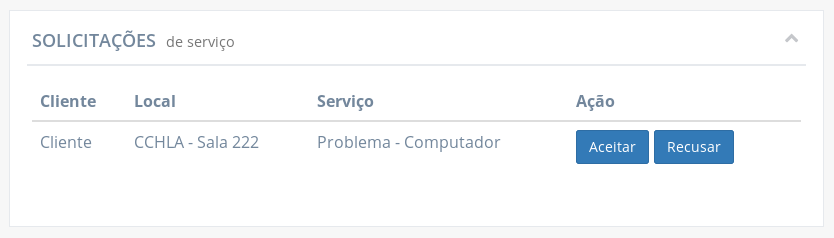

# Funcionalidades disponíveis para gerentes

As funcionalidades a seguir estão disponíveis para usuários que tem a função de gerente.

## Abrir um chamado

Os gerentes, assim como os técnicos, podem abrir chamados diretamente por um cliente. Para isso, basta ir para a página "Solicitar atendimento".

As informações necessárias para abrir um chamado são:

- **Serviço:** qual o tipo de serviço relacionado ao chamado
- **Local:** o local para o qual o serviço se destina
- **Cliente:** nome do cliente para qual o chamado se destina
- **Prazo:** estimativa de quando o chamado terá sido concluído. Deve ser inserido no formato "**dd**/**MM**/**yyyy** às **HH**:**mm**"
- **Descrição:** explicação de qual o problema ou qual o motivo do chamado

!> Os campos **"Serviço"**, **"Local"** e **"Cliente"** não aceitam qualquer texto escrito livremente, sendo necessário selecionar uma das opções oferecidas ao selecionar um campo. O texto digitado serve apenas para buscar entre as opções.

?> No campo **"Cliente"**, é possível pesquisar o cliente a partir do seu _username_, que é único entre todos os usuários, facilitando a procura do cliente desejado.

!> Como o próprio suporte está abrindo o chamado, não é necessário que o mesmo avalie uma solicitação para a aprovar ou recusar, por isso o chamado vai direto para a lista de chamados abertos e em espera para ser atendido.

## Visualizar solicitações de chamado

Na página inicial do gerente, na tabela **"Solicitações de serviço"**, são listadas as solicitações enviadas por clientes.

Daqui, a solicitação pode ser aceita e se tornar um chamado em espera para ser atendido, ou ser recusado.

Clicando na linha de uma das solicitações na tabela permite-se verificar as informações completas da solicitação.

As informações exibidas são:

- **Solicitação:** código identificador da solicitação de chamado
- **Cliente:** nome do cliente para qual o chamado solicitado se destina
- **Local:** sala ou auditório relacionado ao chamado solicitado
- **Status:** status da solicitação. Permanece em "aguardando" até que o suporte aceite ou recuse a solicitação
- **Serviço:** como o chamado solicitado pode ser classificado
- **Data da solicitação:** quando a solicitação foi submetida
- **Descrição:** texto redigido pelo cliente descrevendo melhor o motivo da solicitação.

## Recusar uma solicitação de chamado

Uma solicitação pode ser recusada clicando no botão **"Recusar"** da sua linha na tabela **"Solicitações de serviço"**, na página inicial do gerente.

Ao clicar em **"Recusar"**, uma janela é aberta com o campo **"Motivo da recusa"** habilitado para edição para que o gerente esclareça o motivo da solicitação estar sendo recusada.

A solicitação é, então, removida da tabela caso o botão **"Recusar solicitação"** seja selecionado.

## Aceitar uma solicitação de chamado

Na tabela de "Solicitações de serviço" na página inicial do gerente, as solicitações trazem a opção de serem aceitas ao clicar no botão **"Aceitar"**.

Ao clicar em **"Aceitar"**, uma janela é aberta com o campo **"Prazo"** habilitado para edição, para que o gerente possa informar o dia e hora em que espera-se que o chamado terá sido resolvido.

?> Por padrão, o campo aparece preenchido com a data atual somada de dois dias.

!> O prazo deve ser inserido no formato "**dd**/**MM**/**yyyy** às **HH**:**mm**". Caso o prazo seja informado de outra forma, um alerta é exibido tentar concluir a ação, informando que **"O prazo foi informado em um formato não reconhecido"**.

Ao clicar em **"Aceitar chamado"** na janela, a solicitação é removida da tabela "Solicitações de serviço" e o chamado é incluído na tabela **"Chamados Abertos"** onde permanece na fila para ser assumido por um técnico.

## Visualizar chamados abertos

Na página inicial do gerente, a tabela **"Chamados Abertos"** lista os chamados que tiveram sua solicitação aceita e aguardam na fila para serem atendidos.

As informações completas do chamado podem ser verificadas ao clicar na sua linha na tabela.

As informações exibidas são:

- **Chamado:** código identificador do chamado
- **Cliente:** nome do cliente para qual o chamado se destina
- **Local:** sala ou auditório relacionado ao chamado
- **Status:** status do chamado.
- **Serviço:** como o chamado pode ser classificado
- **Data de abertura:** data e hora de quando o chamado teve sua solicitação aceita
- **Prazo:** estimativa de quando o chamado terá sido concluído
- **Técnico da abertura:** nome do técnico que aprovou a solicitação do chamado
- **Descrição:** texto redigido pelo cliente descrevendo melhor o motivo da solicitação.
