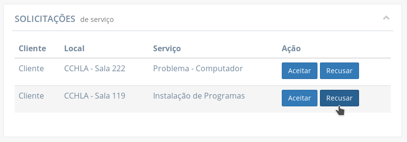
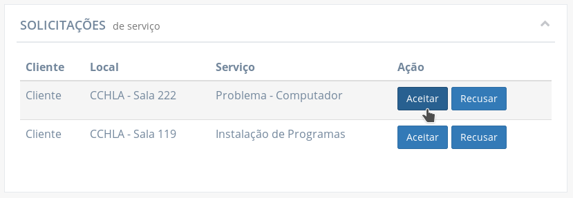

# Funcionalidades disponíveis para gerentes

As funcionalidades a seguir estão disponíveis para usuários que tem a função de gerente.

## Abrir um chamado

Os gerentes, assim como os técnicos, podem abrir chamados diretamente por um cliente. Para isso, basta ir para a página "Solicitar atendimento".

As informações necessárias para abrir um chamado são:

- **Serviço:** qual o tipo de serviço relacionado ao chamado
- **Local:** o local para o qual o serviço se destina
- **Cliente:** nome do cliente para qual o chamado se destina
- **Prazo:** estimativa de quando o chamado terá sido concluído. Deve ser inserido no formato "**dd**/**MM**/**yyyy** às **HH**:**mm**"
- **Descrição:** explicação de qual o problema ou qual o motivo do chamado

!> Os campos **"Serviço"**, **"Local"** e **"Cliente"** não aceitam qualquer texto escrito livremente, sendo necessário selecionar uma das opções oferecidas ao selecionar um campo. O texto digitado serve apenas para buscar entre as opções.

?> No campo **"Cliente"**, é possível pesquisar o cliente a partir do seu _username_, que é único entre todos os usuários, facilitando a procura do cliente desejado.

!> Como o próprio suporte está abrindo o chamado, não é necessário que o mesmo avalie uma solicitação para a aprovar ou recusar, por isso o chamado vai direto para a lista de chamados abertos e em espera para ser atendido.

## Visualizar solicitações de chamado

Na página inicial do gerente, na tabela **"Solicitações de serviço"**, são listadas as solicitações enviadas por clientes.

Daqui, a solicitação pode ser aceita e se tornar um chamado em espera para ser atendido, ou ser recusado.

Clicando na linha de uma das solicitações na tabela permite-se verificar as informações completas da solicitação.

As informações exibidas são:

- **Solicitação:** código identificador da solicitação de chamado
- **Cliente:** nome do cliente para qual o chamado solicitado se destina
- **Local:** sala ou auditório relacionado ao chamado solicitado
- **Status:** status da solicitação. Permanece em "aguardando" até que o suporte aceite ou recuse a solicitação
- **Serviço:** como o chamado solicitado pode ser classificado
- **Data da solicitação:** quando a solicitação foi submetida
- **Descrição:** texto redigido pelo cliente descrevendo melhor o motivo da solicitação.

## Recusar uma solicitação de chamado

Uma solicitação pode ser recusada clicando no botão **"Recusar"** da sua linha na tabela **"Solicitações de serviço"**, na página inicial do gerente.

Ao clicar em **"Recusar"**, uma janela é aberta com o campo **"Motivo da recusa"** habilitado para edição para que o gerente esclareça o motivo da solicitação estar sendo recusada.

A solicitação é, então, removida da tabela caso o botão **"Recusar solicitação"** seja selecionado.

## Aceitar uma solicitação de chamado

Na tabela de "Solicitações de serviço" na página inicial do gerente, as solicitações trazem a opção de serem aceitas ao clicar no botão **"Aceitar"**.

Ao clicar em **"Aceitar"**, uma janela é aberta com o campo **"Prazo"** habilitado para edição, para que o gerente possa informar o dia e hora em que espera-se que o chamado terá sido resolvido.

?> Por padrão, o campo aparece preenchido com a data atual somada de dois dias.

!> O prazo deve ser inserido no formato "**dd**/**MM**/**yyyy** às **HH**:**mm**". Caso o prazo seja informado de outra forma, um alerta é exibido tentar concluir a ação, informando que **"O prazo foi informado em um formato não reconhecido"**.

Ao clicar em **"Aceitar chamado"** na janela, a solicitação é removida da tabela "Solicitações de serviço" e o chamado é incluído na tabela **"Chamados Abertos"** onde permanece na fila para ser assumido por um técnico.

## Visualizar chamados abertos

Na página inicial do gerente, a tabela **"Chamados Abertos"** lista os chamados que tiveram sua solicitação aceita e aguardam na fila para serem atendidos.

As informações completas do chamado podem ser verificadas ao clicar na sua linha na tabela.

As informações exibidas são:

- **Chamado:** código identificador do chamado
- **Cliente:** nome do cliente para qual o chamado se destina
- **Local:** sala ou auditório relacionado ao chamado
- **Status:** status do chamado.
- **Serviço:** como o chamado pode ser classificado
- **Data de abertura:** data e hora de quando o chamado teve sua solicitação aceita
- **Prazo:** estimativa de quando o chamado terá sido concluído
- **Técnico da abertura:** nome do técnico que aprovou a solicitação do chamado
- **Descrição:** texto redigido pelo cliente descrevendo melhor o motivo da solicitação.

## Visualizar chamados em atendimento

O gerente pode verificar todos os chamados que estão sendo atendidos no momento a partir da tabela **"Chamados Em Atendimento"**.

Também pode verificar as informações completas de um chamado em atendimento ao clicar na linha de um deles na tabela. Entre as informações do chamado está a lista de **técnicos responsáveis**, a qual o gerente pode [editar](#editar-responsáveis-por-um-chamado).

Na janela são exibidas as seguintes informações:

- **Chamado:** código identificador do chamado
- **Cliente:** nome do cliente para qual o chamado solicitado se destina
- **Local:** sala ou auditório relacionado ao chamado
- **Status:** status do chamado.
- **Serviço:** como o chamado pode ser classificado
- **Data de abertura:** data e hora de quando o chamado teve sua solicitação aceita
- **Data de assunção:** data e hora de quando o chamado foi retirado da fila para atendimento e foi assumido por um ou mais técnicos
- **Prazo:** estimativa de quando o chamado deve estar concluído
- **Técnico da abertura:** nome do técnico que aprovou a solicitação do chamado
- **Descrição:** texto redigido pelo cliente descrevendo melhor o motivo da solicitação.
- **Técnicos responsáveis:** a lista de técnicos trabalhando no chamado, ou que foram convidados. [Pode ser editada](#editar-responsáveis-por-um-chamado).

## Editar responsáveis por um chamado

Um chamado em atendimento possui, pelo menos, 1 técnico do suporte responsável trabalhando no chamado. O gerente pode editar essa lista acrescentando outros técnicos, alterando os técnicos e/ou suas atividades ou removendo do chamado.

Ao clicar no botão **"Editar responsáveis"** abaixo da lista, são oferecidas as opções de:

- **Cancelar edição:** descarta quaisquer alterações feitas e retorna a lista para o estado original.
- **Adicionar outro técnico:** [adiciona outro cartão](#adicionar-outro-técnico) na lista para escolher um técnico e, opcionalmente, descrever a sua responsabilidade.
- **Salvar:** faz persistir a lista do jeito que está na janela, salvando as alterações que tiverem sido feitas.

Além das opções de cancelar a edição, adicionar técnicos e salvar a lista, também **é possível editar os cartões atuais**, trocando o técnico por outro ou editando o texto que descreve sua responsabilidade. Também é possível [remover cartões](#remover-um-técnico-da-lista) clicando nos botões com símbolo **"-"** que são disponibilizados.

Nas imagens a seguir, o cartão teve o texto da atividade editada e salva após clicar no botão **"Salvar"**.

### Adicionar outro técnico

Para determinar outros técnicos como responsáveis de um chamado existem duas maneiras enquanto se edita a lista de técnicos responsáveis:

- [adicionando outros cartões na lista através do botão "Adicionar outro técnico" e informando qual o técnico acrescentar](#adicionando-atrav%c3%a9s-do-bot%c3%a3o-quotadicionar-outro-t%c3%a9cnicoquot).
- [trocando o técnico de um cartão por outro](#trocando-o-t%c3%a9cnico-de-um-cart%c3%a3o-por-outro)

#### Adicionando através do botão "Adicionar outro técnico"

!> O campo para inserir técnico não aceita qualquer texto escrito livremente, sendo necessário selecionar uma das opções oferecidas ao selecionar o campo. O texto digitado serve apenas para buscar o técnico.

#### Trocando o técnico de um cartão por outro.

Nas duas últimas imagens, a atividade foi redesignada para outro técnico. O "Técnico 2" passa a ser o responsável pela atividade e pelo chamado. Caso o "Técnico 1" não seja designado em outro cartão, ele é [removido dos responsáveis](#remover-um-técnico-da-lista) do chamado.

### Remover um técnico da lista

Enquanto a lista de responsáveis é editada, é possível liberar um técnico da responsabilidade de um chamado de duas maneiras:

- [clicando no botão com sinal de "-" no cartão do técnico](#clicando-no-bot%c3%a3o-com-sinal-de-quot-quot-no-cart%c3%a3o-do-t%c3%a9cnico)
- [trocando o técnico de uma atividade por outro](#trocando-o-t%c3%a9cnico-de-uma-atividade-por-outro)

#### Clicando no botão com sinal de "-" no cartão do técnico

#### Trocando o técnico de uma atividade por outro

Como [exemplificado no tópico de adicionar outro técnico](#adicionar-outro-técnico) trocando por outro, o técnico que é trocado, caso não seja adicionado em um outro cartão, deixa de ser um dos responsáveis pelo chamado.

Nas duas últimas imagens, a atividade foi redesignada para outro técnico. O "Técnico 2" passa a ser o responsável pela atividade e pelo chamado e caso o "Técnico 1" não seja designado em outro cartão ele é removido dos responsáveis do chamado.

!> Caso **todos** os técnicos responsáveis de um chamado **sejam removidos** e a alteração seja salva, o chamado volta do status "ATENDIMENTO" de volta para "AGUARDANDO". Ou seja, sai da lista de chamados em andamento e retorna para a lista de chamados aguardando serem assumidos por um ou mais técnicos.

## Visualizar solicitações de acesso

O gerente controla as contas de acesso ao sistema. Para isso, na página **"Cadastro de Usuário"**, é possível verificar as solicitações de acesso (criação de conta) de usuários, além de editar ou arquivar as solicitações, ou criar um novo usuário manualmente.

É possível, também, verificar se há solicitações de acesso aguardando revisão através da página inicial, pela tabela **"Solicitações de acesso"**.

## Aceitar solicitações de acesso

As solicitações de acesso podem ser aceitas de três formas diferentes:

- [Aceitando diretamente através do botão "Cadastrar"](#aceitando-diretamente-atrav%c3%a9s-do-bot%c3%a3o-quotcadastrarquot)
- [Aceitando um conjunto de solicitações ao mesmo tempo](#aceitando-um-conjunto-de-solicita%c3%a7%c3%b5es-ao-mesmo-tempo)
- [Editando uma solicitação](#editando-uma-solicita%c3%a7%c3%a3o)

?> As contas sempre serão criadas com a **senha de acesso padrão** sendo resultado da união entre o **usuário** (username) e a **matrícula**.

### Aceitando diretamente através do botão "Cadastrar"

!> Quando se aceita diretamente uma solicitação de acesso, o usuário é cadastrado como **cliente**.

!> A **senha de acesso** é a união entre o **usuário** e a **matrícula**. Exemplo: a senha do "Usuário A" será "usuario_a11111"

### Aceitando um conjunto de solicitações ao mesmo tempo

É possível selecionar várias solicitações para aceitar (ou arquivar) mais de uma ao mesmo tempo.

!> Assim como quando se aceita diretamente uma solicitação de acesso, os usuários serão cadastrados como **clientes**.

### Editando uma solicitação

Caso desejado, é possível alterar as informações de um usuário antes de cadastrá-lo. Basta clicar no botão com ícone de lápis no cartão da solicitação para abrir a janela de correção da solicitação.

Clicando no botão **"Cadastrar"** o usuário é cadastrado com as informações exibidas na janela.

!> A **senha de acesso** é a união entre o **usuário** e a **matrícula**. Exemplo: a senha do "Usuário A" será "usuario_a11111"

## Arquivar solicitação de acesso

Caso uma solicitação seja recusada, é possível arquivá-la, isso pode ser alcançado de duas maneiras:

- [arquivando uma solicitação separada](#arquivar-uma-solicitação-separada)
- [arquivando um conjunto de solicitações](#arquivar-um-conjunto-de-solicitações)

### Arquivar uma solicitação separada

Para arquivar uma solicitação de acesso específica, basta clicar no botão com sinal de **"x"** no cartão da solicitação.

Clicando no botão de "x", é aberta uma janela para registrar qual o motivo da recusa da solicitação.

Opcionalmente, é possível especificar uma mensagem para que a pessoa que fez a solicitação seja notificada da recusa da solicitação. Essa opção é marcada por padrão.

Ao clicar no botão **"Arquivar"**, a solicitação é arquivada e, se assim foi definido, o solicitante será notificado que sua conta de acesso não foi efetivada.

### Arquivar um conjunto de solicitações

É possível selecionar várias solicitações para arquivar (ou aceitar) mais de uma ao mesmo tempo. Para isso, seleciona-se as solicitações desejadas e clica-se no botão **"Arquivar selecionados"**.

É exibida uma janela para registrar qual o motivo da recusa da solicitação. Também é possível definir um texto para ser enviado, por e-mail, a todas as pessoas que fizeram a solicitação. Essa opção é marcada por padrão.

Ao clicar no botão **"Arquivar"**, as solicitações serão arquivadas e, se assim foi definido, os solicitantes serão notificados que sua conta de acesso não foi efetivada.

## Criar conta de acesso

Para cadastrar um usuário diretamente, dispensando a criação de solicitação por parte do usuário a partir da página de cadastro, o gerente pode assim fazer clicando no botão **"Criar novo usuário"** presente no topo da página de **"Cadastro de Usuário"**.

Ao clicar no botão "Criar novo usuário", uma janela é exibida para inserir todas as informações necessárias.

?> As contas sempre serão criadas com a **senha de acesso padrão** sendo resultado da união entre o **usuário** (username) e a **matrícula**.

Todos os campos são obrigatórios, sendo eles:

- **Nome:** nome do usuário
- **Usuário:** usuário (_username_) para fazer login no sistema
- **E-mail:** e-mail de contato do usuário
- **Unidade de lotação:** unidade a que pertence o usuário
- **Matrícula:** matrícula do usuário
- **Atividade:** qual a função do usuário no sistema. Apenas uma função pode ser selecionada.
