# Funcionalidades do técnico

As funcionalidades a seguir estão disponíveis para usuários que tem a função de técnico.

## Abrir um chamado

Os técnicos, assim como gerentes, podem abrir chamados diretamente por um cliente. Para isso, basta ir para a página "Solicitar atendimento".

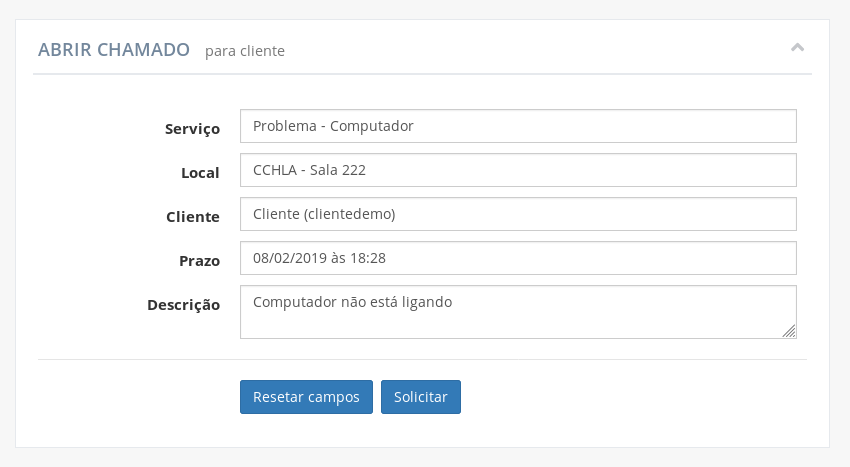

As informações necessárias para abrir um chamado são:

- **Serviço:** qual o tipo de serviço relacionado ao chamado
- **Local:** o local para o qual o serviço se destina
- **Cliente:** nome do cliente para qual o chamado se destina
- **Prazo:** estimativa de quando o chamado terá sido concluído. Deve ser inserido no formato "**dd**/**MM**/**yyyy** às **HH**:**mm**"
- **Descrição:** explicação de qual o problema ou qual o motivo do chamado

!> Os campos **"Serviço"**, **"Local"** e **"Cliente"** não aceitam qualquer texto escrito livremente, sendo necessário selecionar uma das opções oferecidas ao selecionar um campo. O texto digitado serve apenas para buscar entre as opções.

?> No campo **"Cliente"**, é possível pesquisar o cliente a partir do seu _username_, que é único entre todos os usuários, facilitando a procura do cliente desejado.

!> Como o próprio suporte está abrindo o chamado, não é necessário que o mesmo avalie uma solicitação para a aprovar ou recusar, por isso o chamado vai direto para a lista de chamados abertos e em espera para ser atendido.

## Visualizar solicitações de chamado

Na página inicial do técnico, na tabela **"Solicitações de serviço"**, são listadas as solicitações enviadas por clientes.

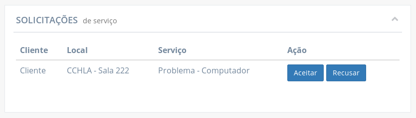

Daqui, a solicitação pode ser aceita e se tornar um chamado em espera para ser atendido, ou ser recusado.

Clicando na linha de uma das solicitações na tabela permite-se verificar as informações completas da solicitação.

As informações exibidas são:

- **Solicitação:** código identificador da solicitação de chamado
- **Cliente:** nome do cliente para qual o chamado solicitado se destina
- **Local:** sala ou auditório relacionado ao chamado solicitado
- **Status:** status da solicitação. Permanece em "aguardando" até que o suporte aceite ou recuse a solicitação
- **Serviço:** como o chamado solicitado pode ser classificado
- **Data da solicitação:** quando a solicitação foi submetida
- **Descrição:** texto redigido pelo cliente descrevendo melhor o motivo da solicitação.

## Recusar uma solicitação de chamado

Uma solicitação pode ser recusada clicando no botão **"Recusar"** da sua linha na tabela **"Solicitações de serviço"**, na página inicial do técnico.

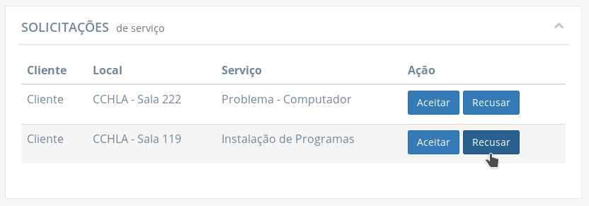

Ao clicar em **"Recusar"**, uma janela é aberta com o campo **"Motivo da recusa"** habilitado para edição para que o técnico esclareça o motivo da solicitação estar sendo recusada.

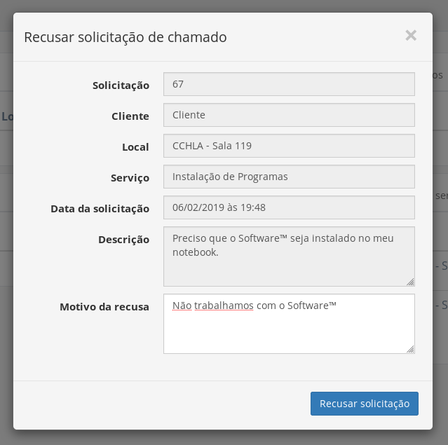

A solicitação é, então, removida da tabela caso o botão **"Recusar solicitação"** seja selecionado.

## Aceitar uma solicitação de chamado

Na tabela de "Solicitações de serviço" na página inicial do técnico, as solicitações trazem a opção de serem aceitas ao clicar no botão **"Aceitar"**.

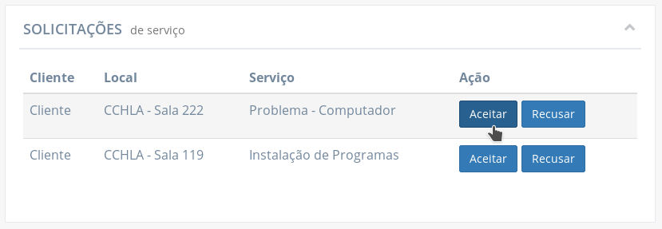

Ao clicar em **"Aceitar"**, uma janela é aberta com o campo **"Prazo"** habilitado para edição, para que o técnico possa informar o dia e hora em que o chamado terá sido resolvido.

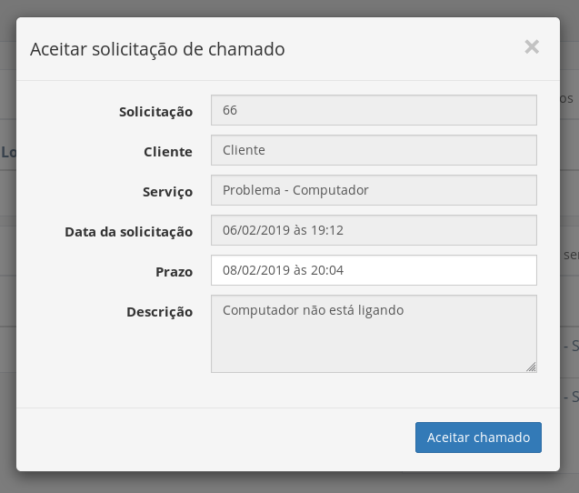

?> Por padrão, o campo aparece preenchido com a data atual somada de dois dias.

!> O prazo deve ser inserido no formato "**dd**/**MM**/**yyyy** às **HH**:**mm**". Caso o prazo seja informado de outra forma, um alerta é exibido tentar concluir a ação, informando que **"O prazo foi informado em um formato não reconhecido"**.

Ao clicar em **"Aceitar chamado"** na janela, a solicitação é removida da tabela "Solicitações de serviço" e o chamado é incluído na tabela **"Chamados Abertos"** onde permanece na fila para ser assumido por um técnico.

## Visualizar chamados abertos

Na página inicial do técnico, a tabela **"Chamados Abertos"** lista os chamados que tiveram sua solicitação aceita e aguardam na fila para serem atendidos.

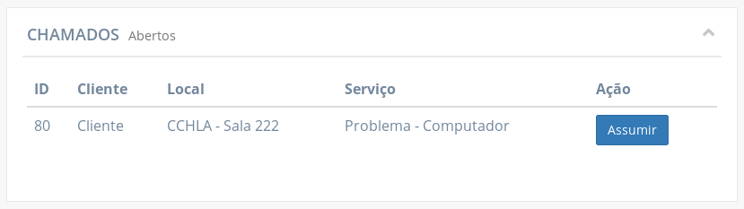

As informações completas do chamado podem ser verificadas ao clicar na sua linha na tabela.

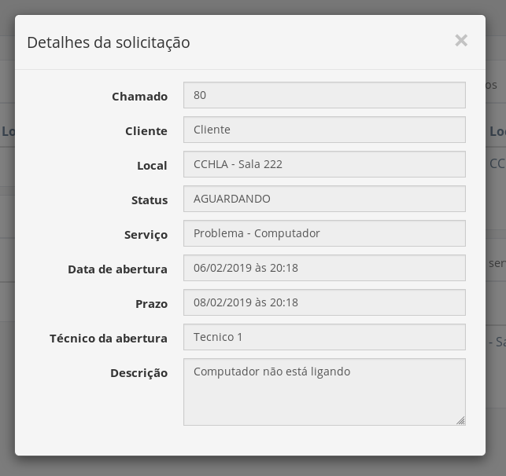

As informações exibidas são:

- **Chamado:** código identificador do chamado
- **Cliente:** nome do cliente para qual o chamado se destina
- **Local:** sala ou auditório relacionado ao chamado
- **Status:** status do chamado.
- **Serviço:** como o chamado pode ser classificado
- **Data de abertura:** data e hora de quando o chamado teve sua solicitação aceita
- **Prazo:** estimativa de quando o chamado terá sido concluído
- **Técnico da abertura:** nome do técnico que aprovou a solicitação do chamado
- **Descrição:** texto redigido pelo cliente descrevendo melhor o motivo da solicitação.

## Assumir um chamado

Assumir um chamado significa que o suporte começou a tomar conta dele, o retirando da fila para atendimento e modificando seu status para **"ATENDIMENTO"**.

Há três formas diferentes de um técnico se tornar responsável por um chamado:

- [Assumindo um chamado a partir da tabela "Chamados abertos"](#a-partir-da-sua-linha-na-tabela)
- [Recebendo e aceitando um convite para ser responsável por um chamado](#aceitando-um-convite)
- Sendo incluído (por um gerente) na lista de responsáveis de um chamado.

As duas primeiras formas acima são explanadas a seguir

### A partir da sua linha na tabela

A tabela **"Chamados abertos"** exibe, para cada linha, o botão **"Assumir"**.

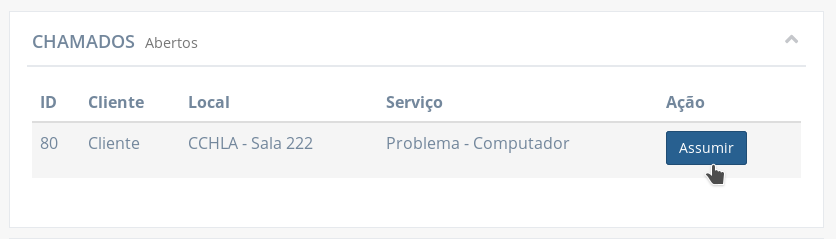

Ao clicar no botão, uma janela é exibida onde o técnico pode:

- Alterar o prazo caso se queira
- Descrever qual será sua responsabilidade no seu cartão, na seção "Técnicos responsáveis"
- Adicionar outros técnicos na seção "Técnicos responsáveis"

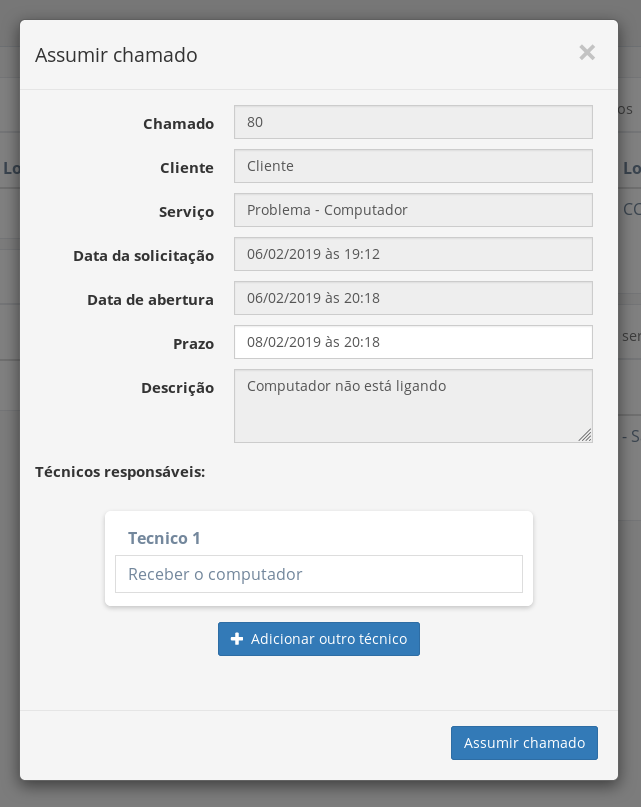

### Aceitando um convite

Quando um técnico é convidado para compartilhar a responsabilidade de um chamado, ele pode aceitar o convite e, assim, assumir o chamado junto ao(s) outro(s) técnico(s) já responsável(is) por aquele chamado.

A aceitação de um convite é explanada no tópico sobre [responder um convite](#responder-um-convite).

## Visualizar chamados de outros técnicos

Um técnico pode visualizar, na tabela **"Outros Chamados Em Atendimento"**, os chamados que outros técnicos assumiram, com chamados que ele não foi convidado ou que foi convidado mas recusou o convite.

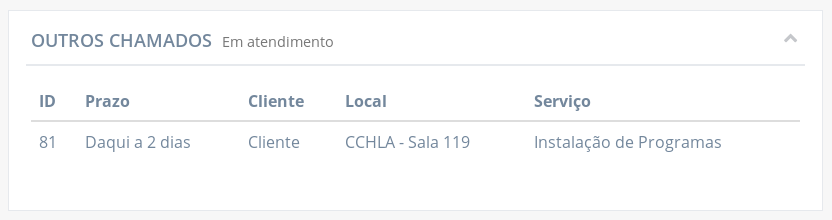

Clicando na linha do chamado na tabela, é possível verificar os dados do chamado, quais os técnicos responsáveis e, se informado, por quais atividades estão responsáveis.

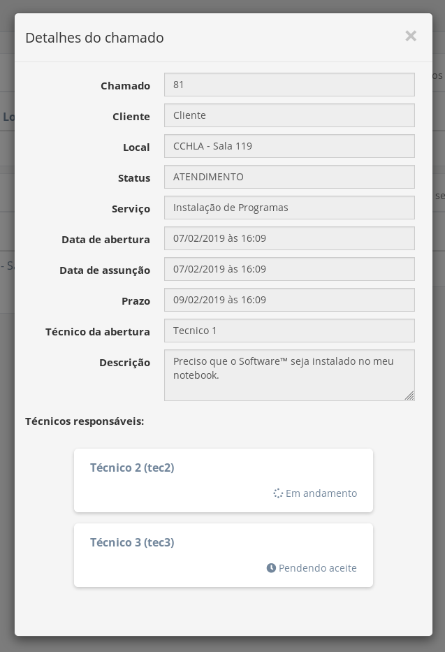

## Convidar outros técnicos a compartilhar chamados

Para os chamados atendidos por mais de um técnico, há a opção de convidar outros técnicos para compartilhar a responsabilidade do chamado.

Convites podem ser aceitos ou recusados. Se aceito, o técnico que aceita ficará visível para o cliente. O técnico que dispensa um convite não fica visível para o cliente mas a recusa permanece registrada e visível para os outros integrantes do suporte.

Para convidar outro técnico, existem duas maneiras:

- [Convidar durante assunção de chamado](#convidando-durante-assunção)
- [Convidar durante o atendimento do chamado](#convidando-durante-atendimento)

### Convidando durante assunção

Quando um técnico vai assumir um chamado e retirá-lo da fila para atendimento, na mesma janela que aparece ao clicar em **"Assumir"** é possível incluir outros técnicos na lista de **"Técnicos responsáveis"** clicando no botão **"Adicionar outro técnico"**.

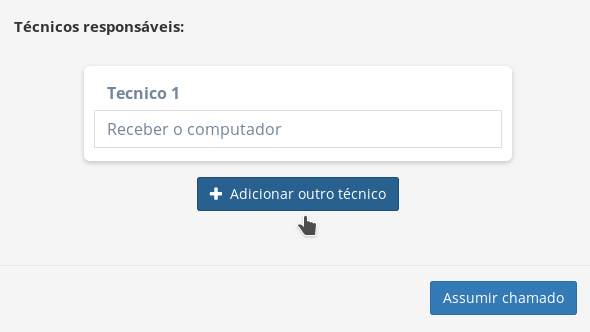

Ao clicar em "Adicionar outro técnico", um novo cartão é inserido na janela para preencher com o técnico a ser convidado e qual atividade a exercer.

?> O campo para descrever a atividade do técnico é opcional de ser preenchido.

!> Quando um técnico é convidado, ele pode alterar o texto que descreve sua atividade no momento de aceite ou recusa.

Caso o técnico assumindo o chamado e criando o convite desista de o fazer, pode clicar no ícone vermelho com símbolo **"-"** para remover o cartão.

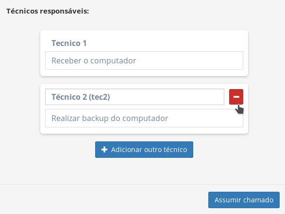

!> O campo de texto para inserir o técnico a ser convidado não aceita qualquer texto. Ele serve para pesquisar entre as opções oferecidas quando o campo recebe foco.

Depois de inserir todos os técnicos desejados para convidar, preencher corretamente cada campo que identifica o técnico e, opcionalmente, descrever as suas atividades, o técnico assumindo o chamado pode concluir a assunção como normalmente clicando no botão **"Assumir chamado"** na janela.

?> É possível convidar todos os outros integrantes do suporte em um chamado só.

### Convidando durante atendimento

Depois que um chamado já foi assumido por um técnico (ou mais convidados), ainda é possível convidar outros técnicos antes de finalizar o chamado. Basta algum dos técnicos já responsáveis abrir (clicando na linha da tabela de chamados em atendimento) a janela de visualização do chamado, ir na lista de **"Técnicos responsáveis"** e clicar no botão **"Adicionar outro técnico"**.

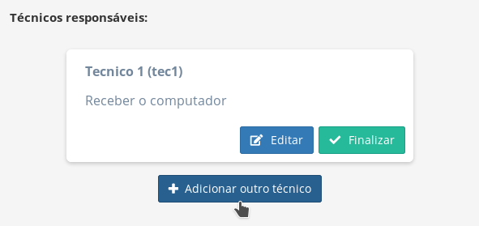

Um novo cartão é adicionado à lista para convidar outro técnico. Depois de, obrigatoriamente, preencher o campo do técnico e, opcionalmente, descrever sua responsabilidade, basta clicar no botão **"Convidar"** para enviar o convite ao técnico informado e o cartão passa a exibir o status de que o convite tá pendendo aceite. Caso desista de convidar, é possível clicar em **"Cancelar"** para descartar o convite.

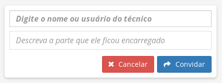

## Responder um convite

Os técnicos podem ser convidados a assumir um chamado junto a outros técnicos, compartilhando as responsabilidades do chamado. O técnico pode responder esse convite o aceitando ou recusando.

Para responder o convite, o técnico precisa abrir (clicando na linha da tabela **"Outros Chamados Em Atendimento"**) a janela de visualização do chamado para o qual foi convidado para visualizar o cartão com o convite.

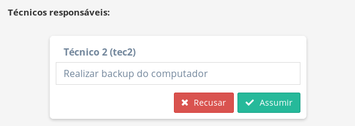

?> O técnico convidado pode alterar o texto da descrição da atividade antes de responder o convite. O novo texto ficará salvo no lugar, visível para os outros técnicos.

Para **aceitar** o convite, basta clicar no botão **"Assumir"**. Ao aceitar o convite, o chamado sai da tabela "Outros Chamados Em Atendimento" e aparece na tabela **"Meus Serviços Em Atendimento"**. O status da responsabilidade fica visível para outros como **"Em andamento"**.

?> O aceite de um convite para compartilhar o atendimento de um chamado é descrito como [uma das formas de assumir um chamado](#aceitando-um-convite).

No caso do técnico convidado **recusar** o convite, o chamado permanece sendo responsabilidade do(s) outro(s) técnico(s) responsável(is).

!> Se o técnico aceita um convite, passa a ficar visível ao cliente que ele é um dos responsáveis pelo chamado e qual sua responsabilidade (se esta estiver inserida no campo da descrição do cartão). Caso o técnico convidado dispense o convite, não fica visível para o cliente mas a recusa permanece registrada e visível para os outros integrantes do suporte.

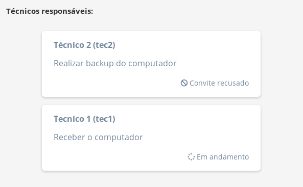

## Descartar um convite pendente

Convites que ainda não foram respondidos e possuem o status **"Pendendo aceite"** podem ser descartados por qualquer técnico que já seja responsável pelo chamado ao qual o convite está relacionado. Para isso, basta abrir (clicando na linha da tabela de chamados em atendimento) a janela de visualização do chamado onde o convite se encontra e, na lista de "Técnicos responsáveis", identificar o convite que se deseja descartar e clicar no ícone vermelho com o símbolo de **"-"**.

## Editar um convite pendente

Quando um convite ainda está pendendo para ser respondido pelo convidado, os técnicos já responsáveis pelo mesmo chamado podem editar e alterar o convite clicando no botão **"Editar"** no cartão.
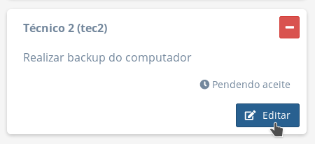

Ao clicar no botão de editar, os campos do técnico e da descrição da atividade se tornam editáveis e os botões "Cancelar" e "Salvar" são disponibilizados.

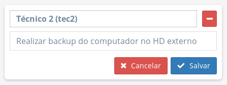

?> É possível redirecionar o convite para outro técnico, editando o campo do técnico.

Após realizar as modificações desejadas, basta clicar no botão **"Salvar"**. Caso desista da edição, o botão **"Cancelar"** reverte as modificações e encerra a edição.

## Visualizar seus atendimentos

Os chamados pelos quais o técnico está responsável (seja por ter assumido diretamente ou aceitando um convite) são listados na tabela **"Meus serviços em atendimento"**.

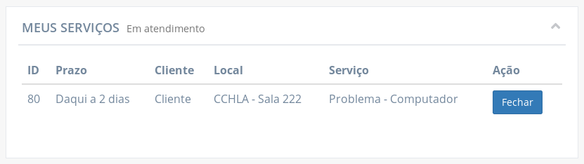

## Editar sua responsabilidade

Quando um técnico é responsável por um chamado e ainda não finalizou sua tarefa, ele pode editar o texto do seu cartão na lista de "Técnicos responsáveis" do chamado.

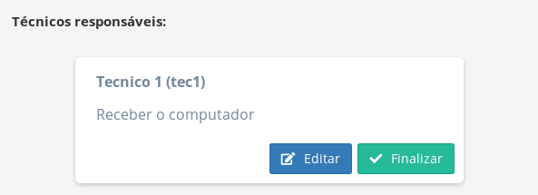

Basta clicar em **"Editar"** para tornar o campo de texto da responsabilidade editável e os botões "Cancelar" e "Salvar" disponíveis.

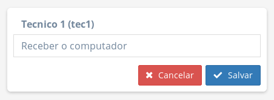

Ao terminar de alterar a descrição da atividade, basta clicar em "Salvar" para armazenar o novo texto. Caso desista, o botão "Cancelar" descarta as alterações e retorna o cartão para o modo de visualização.

## Encerrar sua atividade em um chamado

Após um técnico concluir sua atividade em um chamado, ele deve registrar sua responsabilidade como finalizada.

A sua responsabilidade é marcada como encerrada após clicar no botão **"Finalizar"** no seu cartão, na lista de "Técnicos responsáveis" do chamado. O cartão exibe o status "Realizado" para o cliente ao qual o chamado se destina, além do pessoal do suporte.

Enquanto o chamado não for fechado, o técnico ainda pode [reassumir uma atividade](#reassumir-chamado-em-atendimento) caso tenha que realizar alguma tarefa restante.

## Reassumir chamado em atendimento

Pode acontecer de um técnico encerrar sua atividade em um chamado mas ficar faltando alguma tarefa ou, inesperadamente, surgir uma tarefa a mais para realizar. O técnico pode, então, **registrar que sua tarefa está de volta em andamento** (e, possivelmente, editar a descrição da atividade para melhor retratar a nova realidade).

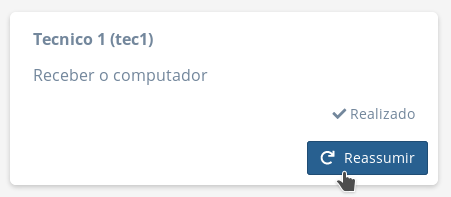

Após clicar no botão **"Reassumir"**, o cartão volta ao status "Em andamento" (na visão do cliente pessoal do suporte) e o técnico volta a poder usar os botões "Editar" e "Finalizar" novamente.

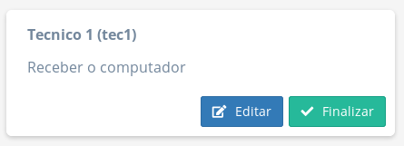

## Fechar um chamado

Fechar o chamado significa o concluir completamente, após todas as atividades dos técnicos responsáveis terem sido realizadas.

!> Um chamado só pode ser fechado quando sua lista de técnicos responsáveis **não possuir convites pendentes ou em andamento**. Se na lista "Técnicos responsáveis" do chamado conter pelo menos um cartão com status "Em andamento" ou "Pendendo aceite", o chamado não pode ser fechado.

Quando todos os cartões na lista de "Técnicos responsáveis" do chamado estiverem com status "Realizado" ou "Convite recusado", a linha do chamado na tabela **"Meus Serviços Em Atendimento"** tem o botão **"Fechar"** disponível.

Ao clicar no botão **"Fechar"** do chamado, uma janela é exibida para que o técnico possa inserir o **"Parecer técnico"**. O parecer serve para esclarecer qual o resultado do serviço ou citar observações finais.

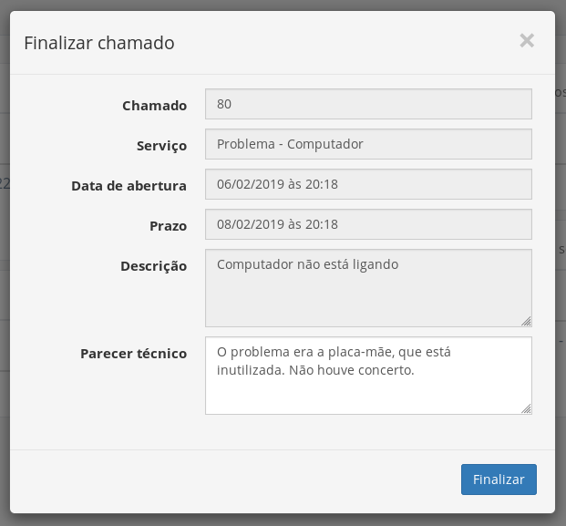

Por fim, ao clicar no botão **"Finalizar"**, o chamado é removido das tabelas dedicadas a chamados em atendimento de todos os integrantes do suporte e do cliente responsável, ficando disponível para visualização apenas no histórico de chamados do cliente ou dos técnicos que foram responsáveis.

## Visualizar histórico de chamados

O técnico pode verificar a lista de todos os chamados encerrados e nos quais foi integrante da lista de técnicos responsáveis na página "Histórico dos meus atendimentos".

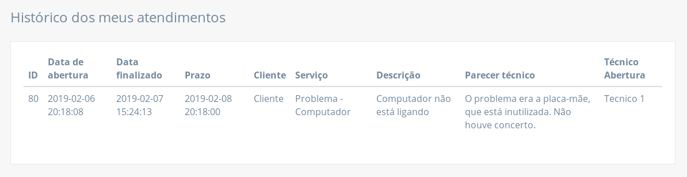

Clicando numa linha da tabela, o cliente pode visualizar as informações completas do chamado.

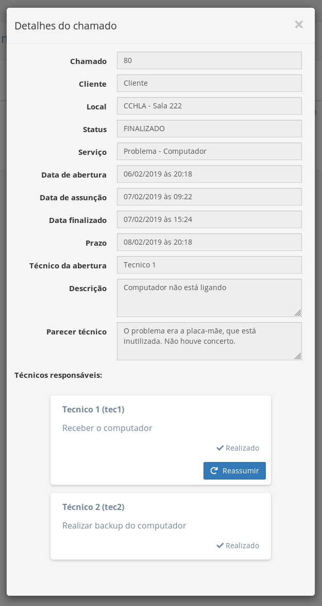

Na janela são exibidas as seguintes informações:

- **Chamado:** código identificador do chamado
- **Cliente:** nome do cliente para qual o chamado solicitado se destinou
- **Local:** sala ou auditório relacionado ao chamado
- **Status:** status da solicitação.
- **Serviço:** como o chamado pode ser classificado
- **Data de abertura:** data e hora de quando o chamado teve sua solicitação aceita
- **Data de assunção:** data e hora de quando o chamado foi retirado da fila para atendimento e foi assumido por um ou mais técnicos
- **Data finalizado:** data e hora de quando o chamado foi concluído pelo suporte
- **Prazo:** estimativa de quando o chamado seria concluído
- **Técnico da abertura:** nome do técnico que aprovou a solicitação do chamado
- **Descrição:** texto redigido pelo cliente descrevendo melhor o motivo da solicitação.
- **Parecer técnico:** texto redigido pelo suporte na finalização do chamado, esclarecendo qual o resultado do serviço ou citando observações, etc.
- **Técnicos responsáveis:** lista dos técnicos responsáveis pela resolução do chamado informando, em cada cartão, o nome do técnico e o status da sua atividade ("Em andamento" ou "Realizado"). O cartão de um técnico pode conter, também, uma descrição da sua atividade.
